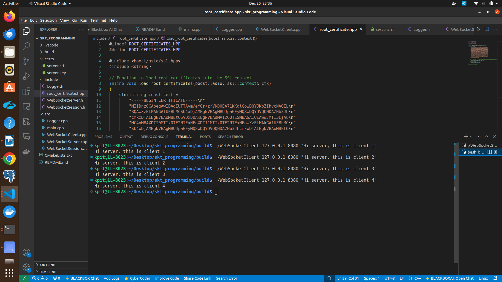
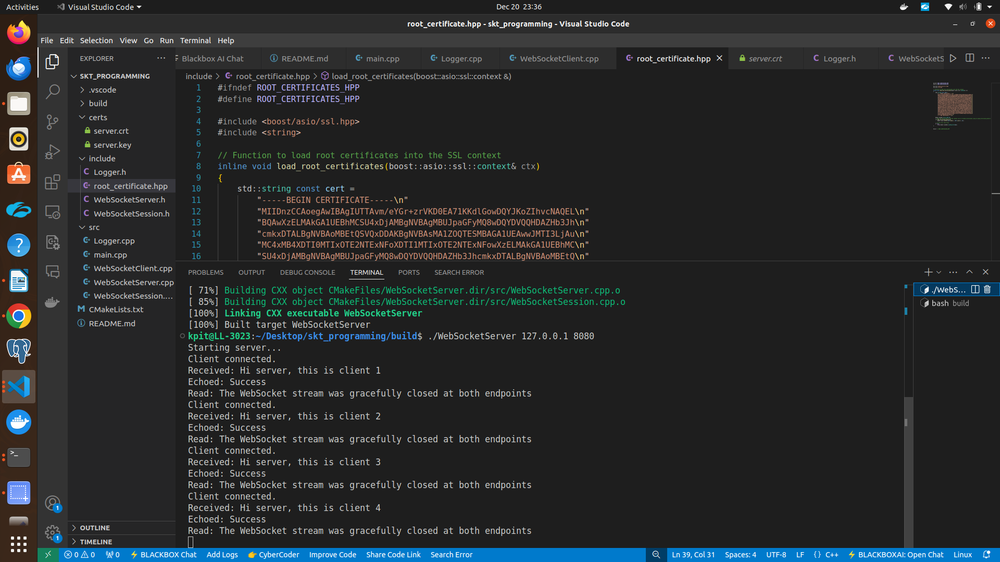

**Socket Programming**

This project demonstrates socket programming using WebSockets with Boost.Beast library. It includes a WebSocket server and client, both using Boost libraries for asynchronous Input/Output.

Project: Created a secure WebSocket-based echo server using c++(Boost.Beast) library in Linux OS.

A websocket-based echo server is a full duplex communication system where both the client and server can send data to each other. The primary function of an echo server is to receive a message from the client and send back the same messages, effectively "echoing" them.

**Install Dependencies**

sudo apt-get install libboost-all-dev libssl-dev libwebsockets-dev cmake

**Building the Project**

1. Clone the repository
   git clone <repository_url>
   cd socket_programming

2. Create a build directory
   mkdir build
   cd build

3. Run CMake:
   cmake ..

4. Build the project:
   make

5. Run the project:

   Server
       ./WebSocketServer IP port

   Client
       ./WebSocketClient IP port message

**File Structure**

webSocketEchoServer/
├── CMakeLists.txt
├── README.md
├── certs/
│   ├── server.crt
│   └── server.key
├── include/
│   ├── Logger.h
│   ├── WebSocketServer.h
│   ├── WebSocketSession.h
│   └── root_certificates.hpp
├── src/
│   ├── Logger.cpp
│   ├── main.cpp
│   ├── WebSocketServer.cpp
│   ├── WebSocketSession.cpp
│   └── WebSocketClient.cpp
└── build/

**Assignment criteria**

1. Code Quality and Secure Coding Practices - implemented secure coding practices using SSL/TSL for secure communication.

2. Maximum Value-Added Features and Configurability - the project includes feature like logging and configurability for different IP addresses and ports.

3. Error and Exception Handling - implemented cerr and exception handling.

4. Use of Object-Oriented Programming - this project uses OOP concepts such as encapsulation and inheritance.

5. Open Source Dependencies - this project uses open-source libraries such as, from Boost(Boost.Asio,Boost.Beast) and OpenSSL for SSL/TLS.

6. Novelty and Innovation - this project uses modern C++ concepts, including use of threads and mutexes to handle multiple connection concurrently.

**Sample output images**

